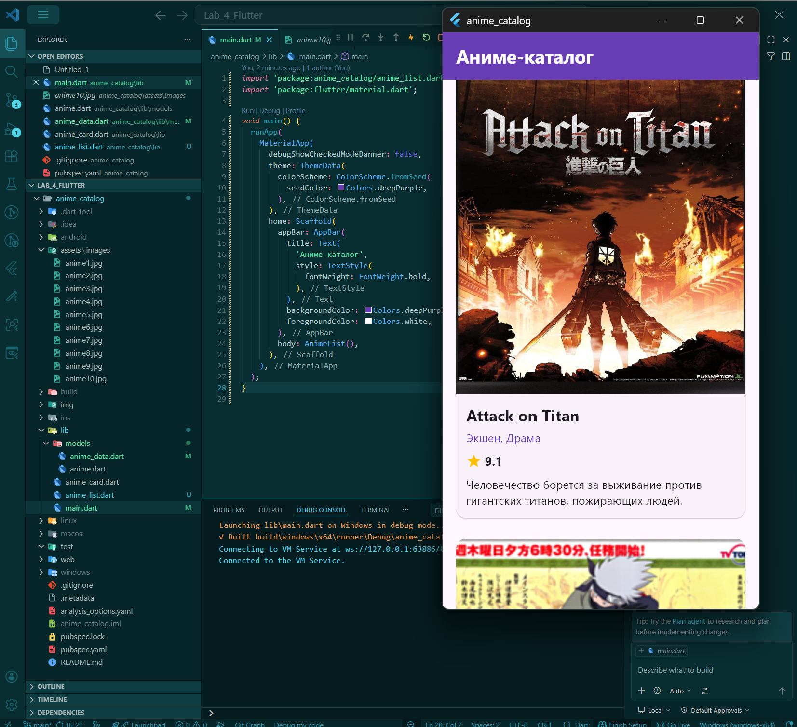

# Лабораторная работа №4: Flutter — Списки, модели данных и карточки

**Студент:** SDA
**Группа:** ISP-232 
**Дата сдачи:** 06.05.2026

---

## 📝 Описание работы

В данной лабораторной работе было разработано мобильное приложение-каталог на фреймворке Flutter. Основной целью было изучение принципов работы со списками данных, создание переиспользуемых виджетов и правильная архитектура хранения данных.

Приложение представляет собой каталог аниме (или другой выбранной тематики), где каждый элемент отображается в виде красивой карточки с постером, названием, рейтингом и описанием.

## 🚀 Что было изучено

В ходе выполнения работы я освоил следующие ключевые концепции Flutter:

1.  **Модели данных (Data Models):** Научился создавать Dart-классы для структурированного хранения информации (название, год, рейтинг, путь к изображению) и использовать `const` конструкторы для оптимизации памяти.
2.  **Эффективные списки (ListView.builder):** Понял разницу между `Column` и `ListView.builder`. Изучил принцип виртуализации списков, когда виджеты создаются только для видимых элементов, что критично для производительности при больших объемах данных.
3.  **Переиспользуемые виджеты (Custom Widgets):** Разбил интерфейс на мелкие компоненты (`AnimeCard`, `_buildPoster`, `_buildInfo`), что сделало код чистым, читаемым и легко поддерживаемым.
4.  **Работа с ресурсами (Assets):** Научился подключать локальные изображения через `pubspec.yaml` и отображать их с помощью виджета `Image.asset` с параметром `BoxFit.cover`.
5.  **Интерактивность и UI:** Реализовал обработку нажатий через `InkWell` с эффектом волны (Ripple Effect) и отображение всплывающих уведомлений (`SnackBar`) при клике на карточку. Также настроил `AppBar` с динамическим счетчиком элементов.

## 📸 Скриншоты приложения

### Основной экран (Каталог)

## 📂 Структура проекта

*   `lib/models/anime.dart` — Класс модели данных.
*   `lib/models/anime_data.dart` — Список данных (константы).
*   `lib/anime_card.dart` — Виджет отдельной карточки аниме.
*   `lib/anime_list.dart` — Экран со списком (`ListView.builder`).
*   `lib/main.dart` — Точка входа в приложение и настройка темы.
*   `assets/images/` — Папка с изображениями постеров.